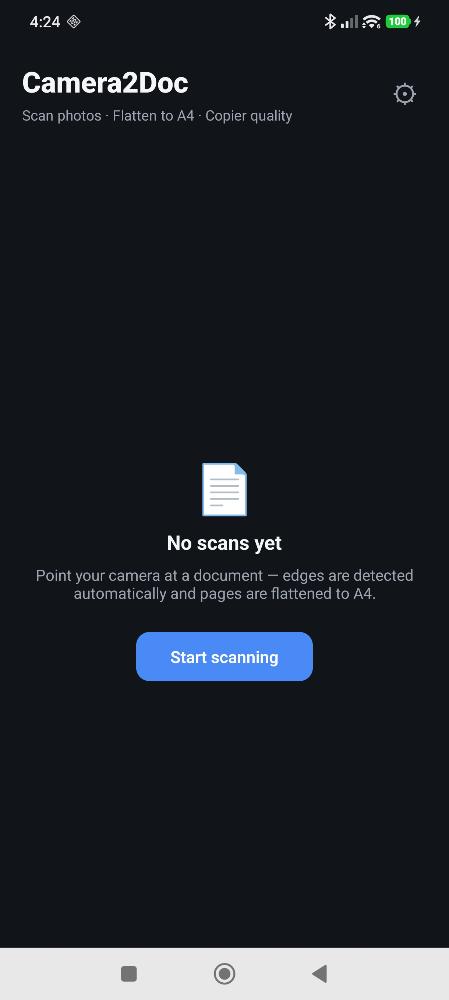
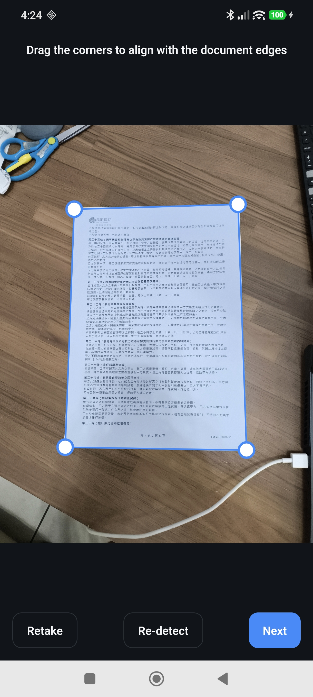
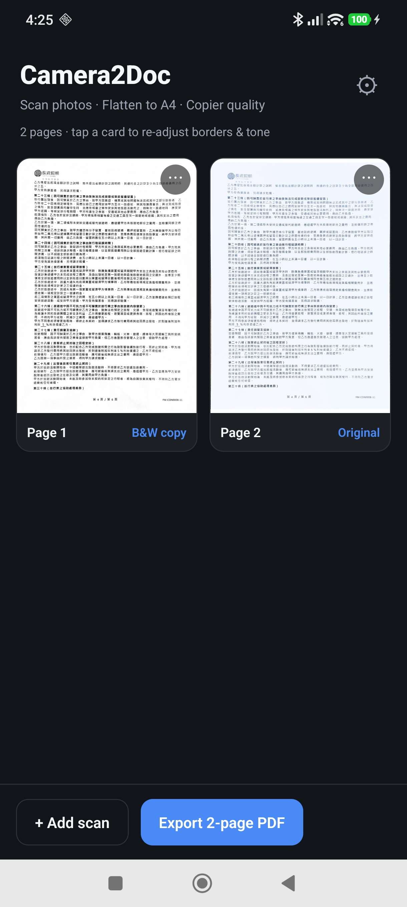

# Camera2Doc

[](https://github.com/caronyang/camera2Doc/actions/workflows/ios.yml)

**English** | [繁體中文](README.zh-TW.md)

## Download (Android)

**[⬇️ Download the latest APK](https://github.com/caronyang/camera2Doc/releases/latest)** — standalone build, no dev server required.

* Package `com.caron.camera2doc` · `arm64-v8a` · minSdk 24 (Android 7+)
* Allow "install unknown apps" when prompted. If a previous build signed with a different key is installed, uninstall it first.
* The APK is signed with the project release key; its SHA-256 is listed in the release notes.

Camera2Doc is a mobile **document scanner** built with React Native / Expo plus a local native module
(OpenCV on Android, Vision + CoreImage + Accelerate on iOS). It does exactly four things, and tries to
do them well:

1. **Photo → document** (camera capture or import from the gallery)
2. **Flatten + straighten** the page into an A4-proportioned, unskewed image
3. **Tone**: `Original` (whitened background, true-to-source colors) or `B&W copy` (copier-like output)
4. **Export**: single page as JPEG or PDF; multiple pages merged into **one A4 PDF**

<p align="center">
  
  
  
</p>
<p align="center"><em>Home · Drag corners to fine-tune the detected page · Page list and one-tap PDF export</em></p>

---

## Features

| | |
|---|---|
| Capture / import | `expo-camera` capture, gallery import |
| Auto edge detection | Android: OpenCV contours pipeline · iOS: `VNDetectDocumentSegmentationRequest` |
| Manual adjust | Four draggable corner handles |
| Flatten | Perspective correction, single-resample (see below) |
| Deskew | Projection-profile search of the dominant content angle; folded into the same warp |
| Original tone | Per-pixel background gain field + anti-clip + paper desaturation + luma unsharp |
| Copy tone | Gain-field normalization + local contrast + S-curve + feathered ink fill + unsharp |
| Export | Single JPEG / single PDF / merged multi-page A4 PDF (pure-JS PDF writer, JPEG embedded via DCTDecode, no re-encode) |
| Languages | English (default) and Traditional Chinese, switchable in-app and persisted |

Output resolution: long edge up to **3800 px** for final output (2800 px for previews), JPEG quality 94.

---

## How the image pipeline works

Everything below is implemented identically on both platforms and validated against a Python reference
implementation (`tools/pipeline_v5.py`, `tools/pipeline_v6.py`).

### 1. Document detection

* **Android** — downscale to 1024 px, grayscale, median blur, Canny, dilate, `findContours`; accept the
  largest convex quadrilateral covering > 12 % of the frame.
* **iOS** — Vision's document segmentation request returns a document-oriented quad (upright text).

### 2. Flatten + straighten, in a single resample

Resampling a page twice (warp, then rotate) visibly softens text. So the deskew angle is *baked into*
the perspective transform:

1. Flatten a small preview, then search the angle that maximizes the horizontal projection profile
   (coarse ±12° in 0.6° steps, then 0.12° fine steps; on Android, Hough long-line candidates compete
   with the projection peak and the best score wins).
2. Rotate the *destination* rectangle by that angle and run one `warpPerspective`
   (Android), or apply the rotation inside the CoreImage graph (iOS).
3. Guard rails: if the angle is < 0.3° or the score gain is < 1.5 %, no rotation is applied at all —
   zero quality loss when it is not needed.

### 3. Tone mapping

**Original** (`original`) — background whitening without color shift:

* background model: ¼-scale large-kernel median (paper brightness, robust to text)
* gain field: `target 245 / background`, clamped to `[1.0, 1.8]` (no over-brightening of well-lit photos)
* **per-pixel anti-clip**: `g = min(gainField, 255 / max(R, G, B))` — no single channel can clip first,
  which is what preserves hue and saturation (a plain uniform gain washed red print out to pink/gray)
* paper desaturation: only `V > 205 && S < 45` pixels (true near-white paper) get `S × 0.35`
* luminance-domain unsharp (σ 1.2, delta 0.9) — sharpens strokes without touching hue

**B&W copy** (`copy`) — copier-like output:

* gain-field normalization (clamped to `[1.0, 2.4]`) flattens illumination gradients and shadows
* CLAHE 3.0 local contrast (Android; iOS approximates it with a local-contrast pass)
* 9-point monotone S-curve (e.g. 120 → 74, 205 → 218) — darkens strokes, pushes faint creases to white
* **ink soft fill**: pixels below 160 get a feathered mask that pushes gray halos down to ≤ 70
  (blend 0.75) — text reads much darker **without dilating strokes** (no fake bold)
* luminance unsharp (σ 1.2, 2.2) for stroke crispness

### 4. Export

A4 padding (1 : √2 white canvas) is optional, on by default. JPEGs are embedded into the PDF with
`/Filter /DCTDecode` by a small pure-TypeScript PDF writer — no image re-encoding, no native dependency.

---

## Architecture

```
Expo SDK 57 · React Native 0.86 · TypeScript · expo-router
│
├─ src/                      App (TypeScript)
│  ├─ app/                   Screens: home → capture → crop → filters → settings
│  ├─ components/            Corner editor, UI primitives
│  ├─ lib/                   i18n, PDF writer, exporter, native bindings, model
│  └─ state/                 Scan session state (React context)
│
└─ modules/camera2doc/       Local Expo native module (auto-linked, no config needed)
   ├─ android/               Kotlin + OpenCV: detection, composed warp, filters
   ├─ ios/
   │  ├─ ScannerAlgorithms.swift   Pure algorithm layer (no Expo/UIKit deps)
   │  └─ Camera2DocModule.swift    Expo glue: Vision detection, I/O, filter calls
   └─ src/                   TypeScript bindings
```

The iOS algorithm lives in `ScannerAlgorithms.swift` so the **same file** is compiled into the app *and*
into the macOS verification CLI (`tools/ios-verify/main.swift`). What CI verifies is what ships.

---

## Getting started

### Requirements

* Node.js 22+
* Android: Android Studio (SDK 36, build-tools 36), JDK 17+
* iOS: macOS + Xcode 16 + CocoaPods

### Android

```bash
npm install
npx expo run:android
```

`android/gradle.properties` sets `reactNativeArchitectures=arm64-v8a` to keep build times down;
remove that line if you need x86_64 emulator support.

### iOS (requires macOS)

```bash
npm install
npx expo prebuild -p ios      # the ios/ folder is intentionally not committed
npx expo run:ios
```

### Release build (signed APK)

```bash
# one-time: create a keystore (kept out of git) and android/keystore.properties
keytool -genkeypair -v -keystore android/app/camera2doc-release.keystore \
  -alias camera2doc -keyalg RSA -keysize 2048 -validity 10000
# android/keystore.properties (git-ignored):
#   storeFile=camera2doc-release.keystore
#   storePassword=... keyAlias=camera2doc keyPassword=...

cd android && ./gradlew :app:assembleRelease
# -> android/app/build/outputs/apk/release/app-release.apk  (arm64-v8a, signed)
```

⚠️ **Back up the keystore and its passwords.** Every future update of an installed app must be signed
with the same key, otherwise Android refuses to install it over the existing one.

### JS-only iteration

```bash
npx expo start          # Metro; reload the installed dev build
npx tsc --noEmit        # type-check
npx expo lint
```

---

## Algorithm development & verification

The algorithm was tuned against a Python reference before being ported, and iOS is verified in CI
without needing a Mac:

| Tool | Purpose |
|---|---|
| `tools/pipeline_v5.py` | Reference implementation (tone v5 baseline) |
| `tools/pipeline_v6.py` | Current reference: `color_v6`, `copy_v6`, `copy_v7` (the shipped algorithm) |
| `tools/ios-verify/main.swift` | Runs the **same Swift algorithm** on macOS: `./verify <inDir> <outDir>`, plus `--make-synthetic` |
| `tools/make_corners.py` | Writes `tools/ios-verify/corners.json` (corner fallbacks for the verifier) |
| `.github/workflows/ios.yml` | Job 1: prebuild + `pod install` + `xcodebuild` (compile check). Job 2: build the verifier, run it on synthetic + `samples/` images, upload JPEG artifacts |

```bash
# macOS / Linux
swiftc -O tools/ios-verify/main.swift modules/camera2doc/ios/ScannerAlgorithms.swift -o verify
./verify --make-synthetic ci-out/synth
./verify ci-out/synth ci-out/out_synth ci-out/synth/corners.json
```

---

## Privacy

No personal data is committed to this repository.

* `TEST_IMAGE/` (private photos used during development) is **git-ignored** and never pushed.
* `samples/` holds only non-sensitive test images and is used by CI and documentation.
* Screenshots in `screenshot/` contain no personal data.

## Status

| | |
|---|---|
| Android | Verified on a physical device (POCO X6 Pro, Android 15): detection, flatten, deskew, both tones, JPEG/PDF export |
| iOS | Code complete; compile + algorithm verification run in CI (no Mac available locally). On-device testing pending |
| Known iOS differences | no CLAHE (approximated by local contrast) and deskew uses the projection method only (no Hough candidates) |

## Roadmap

* iOS on-device validation (EAS Build or sideload)
* Page reordering, per-page retake
* OCR text layer
* Decurve (mesh) unwarping for strongly curled pages

## License

MIT — see [LICENSE](LICENSE).
